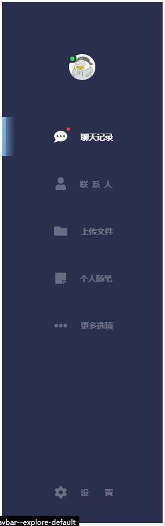
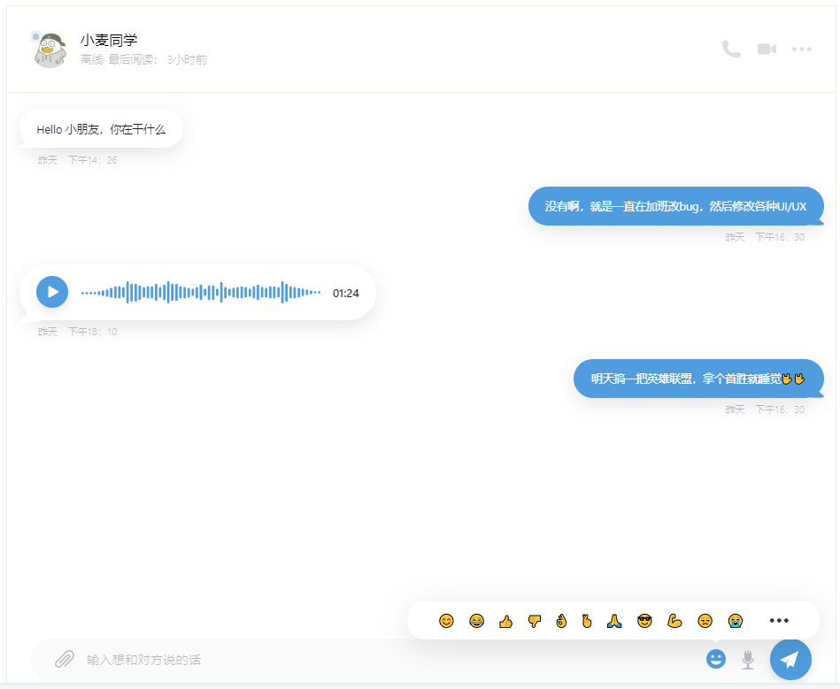

### How to See the demo
- npm install / yarn install
- npm run storybook

### Demo Picture

### All Lib Used
1. storybook -> 官网 https://storybook.js.org/
2. styled-components
3. classnames
4. 使用jsconfig.json文件，以后导入图片不需要使用相对路劲，可以使用绝对路劲
5. Hygen模板生成器：
6. svg图片使用，以及 fontawesome使用