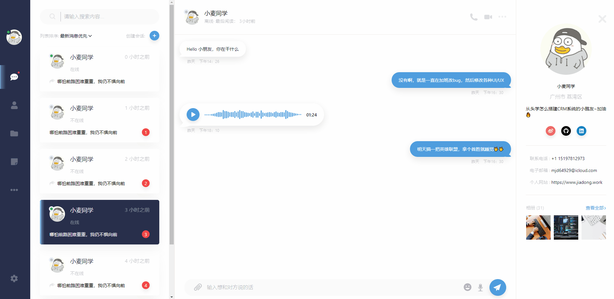

### 怎么使用
- npm install / yarn install
- npm run start / yarn start

### Demo GIF 动态图

### 全部使用的库
1. storybook -> 官网 https://storybook.js.org/
2. styled-components
3. classnames
4. 使用jsconfig.json文件，以后导入图片不需要使用相对路劲，可以使用绝对路劲
5. Hygen模板生成器：
6. svg图片使用，以及 fontawesome使用
7. theme.js 使用，使用 styled-components中的<ThemeProvider theme={theme}> 包裹App组件那么App中所有组件都可以使用Theme.js
8. React-Router-DOM
9. React-spring 生成动画